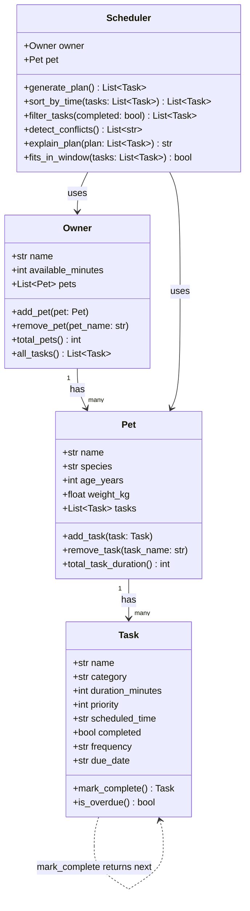

# PawPal+ Project Reflection

## 1. System Design

### Core User Actions

1. **Add/manage a pet** — The owner enters their profile and registers one or more pets with basic info (name, species, age, weight). This gives the system the subject of all care tasks.
2. **Add and edit care tasks** — The owner creates tasks like "morning walk", "feed breakfast", or "give medication", each with a duration (in minutes) and a priority level. Tasks can be updated or removed as needs change.
3. **Generate and view today's daily plan** — The owner requests a scheduled plan for the day. The system fits tasks into the owner's available time window, orders them by priority and feasibility, and displays the resulting schedule with reasoning.

**a. Initial design**

Four classes drive the system:

- **Owner** — stores owner name and daily available time (in minutes); acts as the top-level container that holds a list of pets
- **Pet** — stores pet name, species, age, and weight; holds the list of care tasks assigned to that pet
- **Task** — a dataclass holding task name, category (walk/feed/med/etc.), duration, priority (1–5), optional scheduled time, and completion status
- **Scheduler** — receives an owner + pet and generates an ordered daily plan by fitting tasks into the available time window, prioritizing by level, and returning a list of scheduled tasks with a plain-language explanation

Relationships: Owner → (has many) Pet → (has many) Task; Scheduler depends on Owner and Pet.

**b. Design changes**

Two meaningful changes happened between the initial UML and the final implementation.

First, `Task` grew two new fields: `frequency` ("once", "daily", "weekly") and `due_date`. These weren't in the original design — the initial plan treated every task as a one-time event. But during the algorithmic phase it became clear that daily care tasks (feeding, medication) are inherently recurring. Rather than create a separate `RecurringTask` subclass (which would have added inheritance complexity for a small gain), I added `frequency` directly to `Task` and let `mark_complete()` return the next occurrence as a new instance. The return type changed from `None` to `Optional[Task]`, which was a deliberate departure from the stub.

Second, `Scheduler` expanded significantly. The original design had three methods; the final version has six. `sort_by_time()`, `filter_tasks()`, and `detect_conflicts()` were all added during the algorithmic phase once it was clear the basic plan generation wasn't enough to make the app genuinely useful. `Owner` also gained `all_tasks()` — a convenience method not in the original UML — to support cross-pet task views.

---

## 2. Scheduling Logic and Tradeoffs

**a. Constraints and priorities**

The scheduler considers two main constraints: available time (the owner's total free minutes per day) and task priority (a 1–5 scale). Tasks are sorted by priority descending, then greedily added to the plan until the time budget is exhausted. Lower-priority tasks are dropped rather than partially scheduled.

Priority won out over time-of-day as the primary sort key because a pet owner should always do the most important tasks first — if time runs out, it should be the low-priority enrichment that gets cut, not the medication.

**b. Tradeoffs**

The conflict detector only flags tasks with the **exact same start time** — it does not check whether task durations overlap (e.g., a 30-minute walk at 08:00 and a 10-minute feeding at 08:15 would not be flagged). This is a deliberate simplification: implementing full interval-overlap detection would require converting time strings to datetime objects, calculating end times, and comparing ranges — meaningful added complexity for an edge case most pet owners won't hit. The exact-match check catches the most obvious scheduling mistakes (two things literally booked at the same moment) with minimal code. A future iteration could add full overlap detection using `datetime.strptime` and comparing start + duration intervals.

---

## 3. AI Collaboration

**a. How you used AI**

AI was used in three distinct roles throughout the project.

For design, I described the app scenario and asked for a class structure. The AI produced a reasonable starting point — four classes with clear responsibilities — but the initial output was a skeleton without any real logic, which meant the design decisions (like whether `Scheduler` should own the time budget or `Owner` should) still had to be made explicitly.

For implementation, the most effective prompts were specific and bounded: "implement `generate_plan()` so that tasks are sorted by priority and dropped when time runs out" produced directly usable code. Open-ended prompts like "make the scheduler smarter" produced bloated suggestions that needed heavy trimming.

For testing, asking "what are the edge cases for a pet with no tasks?" was more useful than asking for a test file outright — it surfaced cases I hadn't considered (empty pet, unscheduled conflict detection, idempotent completion) that became actual test functions.

**b. Judgment and verification**

When AI generated the initial class skeletons, the `Pet` and `Owner` dataclasses both used bare `list` with no type annotation for their collection fields — for example, `tasks: list = field(default_factory=list)`. That works at runtime, but it loses all type information, meaning nothing tells you (or your editor) that `tasks` should only contain `Task` objects. It's the kind of thing that causes silent bugs later when you accidentally append the wrong type.

The fix was to use `List[Task]` and `List[Pet]` from Python's `typing` module. I initially tried `list[Task]` with `from __future__ import annotations` to handle potential forward references, but Pyright flagged the dataclass fields as `list[Unknown]` — the future-annotations import was interfering with the type checker's ability to resolve the generic parameter. Switching to `typing.List` resolved it cleanly and works across Python versions without that side effect.

I verified this by reading the Pyright error (`Type of "tasks" is partially unknown`) and testing both approaches — `List[Task]` from `typing` resolved cleanly while `from __future__ import annotations` did not.

---

## 4. Testing and Verification

**a. What you tested**

The 29-test suite covers five behavioral areas: task completion (including idempotency and recurring next-occurrence creation), pet task management (add, remove, duration totals), owner multi-pet access, scheduler plan generation (priority ordering, time limit enforcement), and the three algorithmic additions — sort by time, filter by status, and conflict detection.

The recurrence tests were the most important ones to get right. The behavior of `mark_complete()` returning a new `Task` is a non-obvious side effect that could silently break if the `frequency` field defaulted incorrectly or if `timedelta` math was off by one. Testing both the "once" path (returns `None`) and the "daily"/"weekly" paths (returns a new task with the correct due date) gave confidence that the feature works as intended and won't regress.

**b. Confidence**

4/5. The core scheduling logic — priority sort, time-window enforcement, conflict flagging — is well-covered and I'm confident it's correct. The main untested gap is full duration-overlap detection: if a 30-minute task starts at 08:00 and another starts at 08:15, the system won't flag it. That's a known limitation documented in §2b, not a bug. If I had more time, I'd test the `is_overdue()` method (currently requires mocking the system clock) and add parametrized tests across a wider range of priority/duration combinations to catch greedy-algorithm edge cases.

---

## 5. Reflection

**a. What went well**

The part I'm most satisfied with is the recurring task design. The decision to have `mark_complete()` return an `Optional[Task]` rather than void was a small API choice that made the feature clean — callers can check the return value and decide what to do with it, and the `Task` class doesn't need to know anything about pets or schedulers to produce the next instance. It's a good example of keeping a class responsible only for its own data.

**b. What you would improve**

The `Scheduler` class takes a single `Pet` at construction time, which means generating a cross-pet plan requires instantiating one scheduler per pet in a loop. That was a reasonable early design choice, but it makes multi-pet conflict detection (e.g., the owner can't walk Mochi and feed Luna at the same time) impossible without restructuring. If I had another iteration, I'd refactor `Scheduler` to accept the `Owner` directly and operate across all pets, rather than one at a time.

**c. Key takeaway**

The most important thing I learned is that AI is most useful when you already know what you want and just need the syntax — and least useful when you're still figuring out what you want. The times I got code I could actually use were when I gave the AI a precise, bounded problem. The times I got unusable output were when I asked it to "design" something open-ended. That distinction — AI as a fast typist, not an architect — is the most practically useful thing I took from this project.
