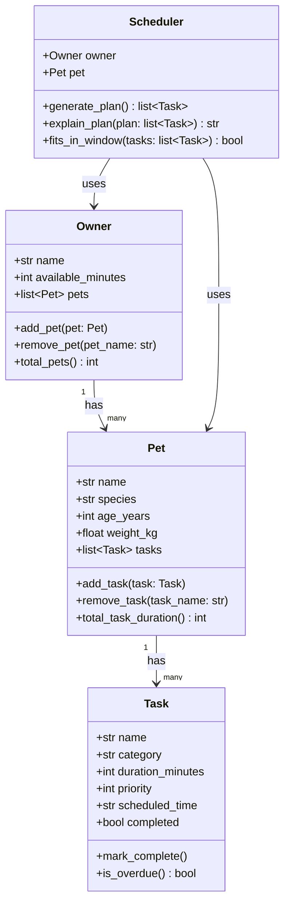

# PawPal+ Project Reflection

## 1. System Design

### Core User Actions

1. **Add/manage a pet** — The owner enters their profile and registers one or more pets with basic info (name, species, age, weight). This gives the system the subject of all care tasks.
2. **Add and edit care tasks** — The owner creates tasks like "morning walk", "feed breakfast", or "give medication", each with a duration (in minutes) and a priority level. Tasks can be updated or removed as needs change.
3. **Generate and view today's daily plan** — The owner requests a scheduled plan for the day. The system fits tasks into the owner's available time window, orders them by priority and feasibility, and displays the resulting schedule with reasoning.

**a. Initial design**

Four classes drive the system:

- **Owner** — stores owner name and daily available time (in minutes); acts as the top-level container that holds a list of pets
- **Pet** — stores pet name, species, age, and weight; holds the list of care tasks assigned to that pet
- **Task** — a dataclass holding task name, category (walk/feed/med/etc.), duration, priority (1–5), optional scheduled time, and completion status
- **Scheduler** — receives an owner + pet and generates an ordered daily plan by fitting tasks into the available time window, prioritizing by level, and returning a list of scheduled tasks with a plain-language explanation

Relationships: Owner → (has many) Pet → (has many) Task; Scheduler depends on Owner and Pet.

**b. Design changes**

- Did your design change during implementation?
- If yes, describe at least one change and why you made it.

---

## 2. Scheduling Logic and Tradeoffs

**a. Constraints and priorities**

- What constraints does your scheduler consider (for example: time, priority, preferences)?
- How did you decide which constraints mattered most?

**b. Tradeoffs**

- Describe one tradeoff your scheduler makes.
- Why is that tradeoff reasonable for this scenario?

---

## 3. AI Collaboration

**a. How you used AI**

- How did you use AI tools during this project (for example: design brainstorming, debugging, refactoring)?
- What kinds of prompts or questions were most helpful?

**b. Judgment and verification**

When AI generated the initial class skeletons, the `Pet` and `Owner` dataclasses both used bare `list` with no type annotation for their collection fields — for example, `tasks: list = field(default_factory=list)`. That works at runtime, but it loses all type information, meaning nothing tells you (or your editor) that `tasks` should only contain `Task` objects. It's the kind of thing that causes silent bugs later when you accidentally append the wrong type.

The fix was to use `list[Task]` and `list[Pet]` with proper generic annotations. But that introduced a second problem: Python dataclasses can't reference a class in its own type hint at definition time — `Pet` can't have `list[Task]` if `Task` is defined after it, or if the interpreter hasn't finished building the class yet. The solution is `from __future__ import annotations` at the top of the file, which makes Python evaluate all annotations lazily as strings instead of eagerly, resolving the forward-reference issue entirely.

I verified this by checking the Python docs on PEP 563 and confirming that `from __future__ import annotations` is the standard fix for forward references in dataclasses.

---

## 4. Testing and Verification

**a. What you tested**

- What behaviors did you test?
- Why were these tests important?

**b. Confidence**

- How confident are you that your scheduler works correctly?
- What edge cases would you test next if you had more time?

---

## 5. Reflection

**a. What went well**

- What part of this project are you most satisfied with?

**b. What you would improve**

- If you had another iteration, what would you improve or redesign?

**c. Key takeaway**

- What is one important thing you learned about designing systems or working with AI on this project?
